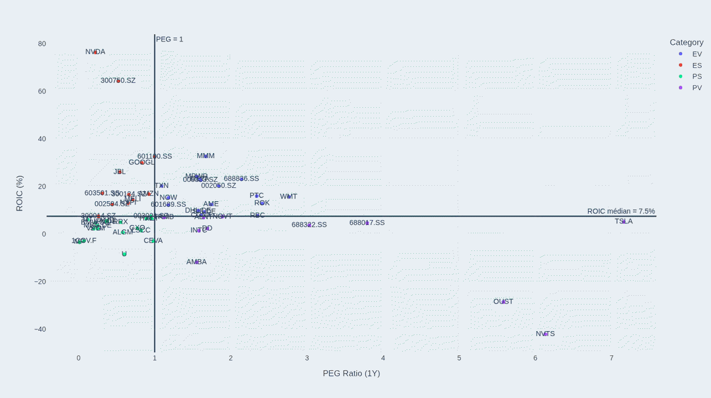
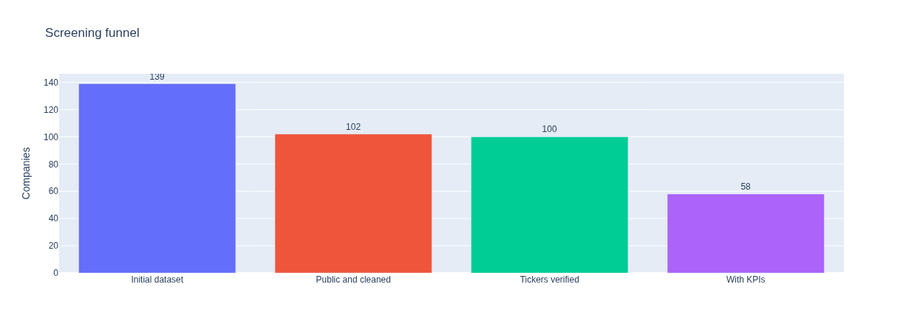
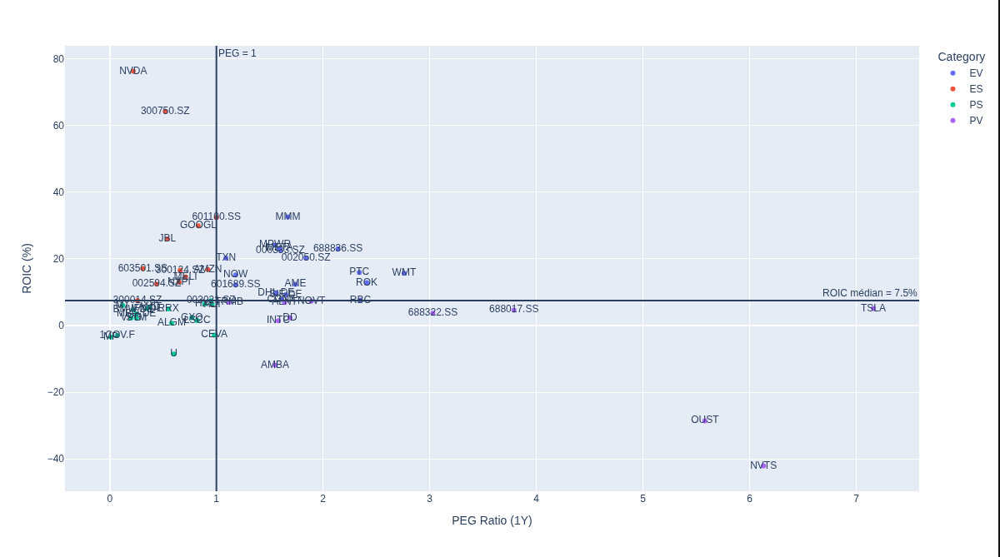

# 🤖 Robotics Supply Chain & Stock Screening

**Screening de 58 sociétés cotées de la supply chain robotique sur 2 KPIs financiers : PEG Ratio et ROIC.**

<p align="center">
  
</p>

## 🎯 Contexte & objectif

Un robot n'est jamais une seule entreprise : c'est des aimants, des batteries, des puces, des capteurs, des engrenages, du logiciel, de l'intégration et de la maintenance, tout empilé. L'essentiel de la valeur se loge dans les composants, pas chez les marques de robots.

À partir d'un travail de recherche sectorielle assisté par IA, j'ai constitué une liste de **139 sociétés** exposées à la filière. La question qui a déclenché le projet : **lesquelles méritent qu'on creuse le dossier ?**

> C'est un **exercice d'entraînement**, pas du conseil en investissement.

## 🗂️ Résultats

2 sociétés potentiellement sous-évaluées se détachent clairement du lot : **NVIDIA et CATL.**

| Ticker | Société | PEG Ratio | ROIC (%) |
|---|---|--:|--:|
| `NVDA` | NVIDIA Corporation | **0.22** | **76.3** |
| `300750.SZ` | Contemporary Amperex Technology (CATL) | **0.52** | **64.2** |

Ces deux-là cumulent **un PEG inférieur à 1 et un ROIC supérieur à 2× la médiane** de l'échantillon (7.46%). Cinq autres sociétés franchissent ce double filtre (Alphabet, Jabil, OmniVision, Amazon, Inovance), mais aucune ne rivalise avec NVIDIA et CATL sur l'efficacité du capital : leur ROIC plafonne entre 16 et 30%, contre 76% et 64%.

Une analyse fondamentale approfondie de ces deux entreprises peut donc se révéler pertinente pour identifier une potentielle opportunité d'invesstissement.

## 🧰 Stack technique

| Catégorie | Technologie | Rôle |
|---|---|---|
| Langage | **Python 3.12** | Exécution de toute la chaîne de traitement |
| Manipulation de données | **Pandas 3.0** | Chargement des CSV, nettoyage par regex, déduplication, agrégations par ticker |
| Récupération de données | **yfinance 1.7** | Extraction des données financières |
| Visualisation | **Plotly 7.1** | Scatter plot interactif PEG × ROIC et entonnoir du dataset, avec survol pour afficher les noms complets |
| Environnement | **JupyterLab / ipykernel** | Exécution pas à pas des notebooks (un par étape du pipeline), ou du pipeline complet d'un seul bloc |
| Contrôle de version | **Git / GitHub** | Historique du projet et versionnage des datasets intermédiaires |

## 🔎 Mon approche

| # | Étape | Notebooks | Ce que j'ai fait | n |
|---|---|---|---|---|
| 1 | **Exploration** | `01_STOCKS_exloration_.ipynb` | Exploration du dataset. | |
| 2 | **Nettoyage** | `02_STOCKS_cleaning.ipynb` | Extraction des tickers avec du REGEX, suppression des suffixes des places de marché, exclusion des sociétés non cotées, fusion par ticker (une ligne par ticker, supply chain layers agrégés). | 139 → **102 lignes** |
| 3 | **Validation** | `03_STOCKS_clean_tickers.ipynb` | Tests pour vérifier que yfinance reconnaît bien les tickers, puis correction des tickers non fonctionnels en ajustant les suffixes selon les places de marché. | 102 → **100** |
| 4 | **Construction des KPIs** | `04_STOCKS_yfinance_kpis.ipynb` | Construction des KPIs avec une boucle `for` et gestion d'erreurs avec `try/except`, puis filtrage (PEG négatif, PEG > 10, données manquantes) et classification de chaque ticker restant dans un des 4 quadrants (`ES` / `EV` / `PS` / `PV`). | 100 → **58** |
| 5 | **Visualisation** | `05_STOCKS_analysis.ipynb` | Scatter plot coloré par quadrant, relecture du fichier de KPIs déjà filtré. | **58 points** |
| **00** | **Pipeline complet** | `00_STOCKS_pipeline_full.ipynb` | Les étapes 1 à 5 regroupées dans un seul notebook, exécutables d'un bloc via `Restart & Run All`. | 139 → **58** |

<p align="center">
  
</p>

## ⚒️ Les KPIS

> **Quelles sociétés sont à la fois efficaces dans l'usage de leur capital et raisonnablement valorisées ?**

J'ai utilisé pour cette analyse 2 KPIs complémentaires :

- Le **PEG** : il capte la valorisation **relative à la croissance attendue**
- Le **ROIC** : il mesure l'**efficacité du capital immobilisé**.

Un seul des deux ne suffit pas : le PEG seul favorise les valorisations sous-tendues par des hypothèses optimistes, le ROIC seul favorise les sociétés chères mais solides.

Les deux KPIs servent aussi à **classer** chaque ticker dans le quadrant où il se situe (voir le tableau des quadrants plus bas) : une fonction `get_category` renvoie `ES`, `EV`, `PS` ou `PV` selon la position du ticker par rapport aux deux frontières (PEG = 1 et médiane du ROIC).

Le classement ne porte que sur les tickers **comparables**, filtrés à l'étape 4 : `0 < PEG ≤ 10` et les deux KPIs présents. Les cas restants sont écartés à ce stade, il n'y a donc pas de catégorie « inclassable » dans le graphique final.

## 📊 L'analyse

Les données sont représentées sur un scatter plot. 

<p align="center">
  
</p>

On peut découper celui-ci en **quatre catégories** (choix arbitraire) :

| Catégorie | Catégorie (acronyme) | PEG | ROIC | n | Description |
|---|---|---|---|--:|---|
| **Efficaces & sous-évaluées** | `ES` | ≤ 1 | ≥ 7.46% (médiane) | 12 | Rentabilité du capital au-dessus du groupe pour une valorisation sous le seuil de 1 : la combinaison la plus favorable du lot. |
| **Efficaces & déjà valorisées** | `EV` | > 1 | ≥ 7.46% (médiane) | 17 | Bonne exploitation du capital, mais le prix intègre déjà cette qualité. |
| **Sous-évaluées & peu efficaces** | `PS` | ≤ 1 | < 7.46% (médiane) | 18 | Valorisation basse, mais souvent portée par une croissance faible ou une rentabilité dégradée : la référence basse est ici un piège. |
| **Chères & peu efficaces** | `PV` | > 1 | < 7.46% (médiane) | 11 | Multiple élevé et efficacité du capital faible : demanderait une vraie thèse de redressement. |

## 📁 Structure du repository

```text
Robotics-Supply-Chain-Data-Analysis/
│
├── data/
│   ├── raw/
│   │   └── stocks/
│   │       └── stocks.csv                          # 139 sociétés issues de la recherche sectorielle
│   │
│   └── processed/
│       └── stocks/
│           ├── stocks_cleaned.csv                  # 102 lignes, tickers nettoyés et dédupliqués
│           ├── tickers.csv                          # 102 lignes, colonne ticker seule
│           ├── stocks_transformed_verified.csv      # 100 lignes, tickers résolus sur yfinance
│           └── stocks_kpis.csv                      # 58 lignes, Ticker / PEG Ratio (1Y) / ROIC (%) / Name / Category
│
├── notebooks/
│   └── Stocks Analysis/
│       ├── 00_STOCKS_pipeline_full.ipynb           # étapes 1 à 5 dans un seul notebook
│       ├── 01_STOCKS_exloration_.ipynb
│       ├── 02_STOCKS_cleaning.ipynb
│       ├── 03_STOCKS_clean_tickers.ipynb
│       ├── 04_STOCKS_yfinance_kpis.ipynb
│       ├── 05_STOCKS_analysis.ipynb
│       └── 06_Recap.ipynb                          # entonnoir du dataset
│
├── docs/
│   └── images/
│       ├── funnel.png
│       ├── overview.gif
│       └── scatter_plot.png
│
├── .vscode/
│   └── settings.json
│
├── .gitignore
├── requirements.txt
└── README.md
```

## ⚠️ Limites & prochaines étapes possibles

Ceci est un projet pour m'entraîner et m'amuser, il comporte de nombreuses limites assumées et ne cherche pas à être exhaustif.

Limites :

- **Analyse simplifiée** : l'analyse porte uniquement sur 2 KPIs mais cela reste limité : de nombreux autres KPis entrent en compte dans l'analyse fondamentale poussée d'une entreprise.
- **Manque de data** : 42 tickers sur 100 n'ont pas été analysés (PEG ou ROIC non calculable, PEG négatif, PEG > 10). Une approche différente des KPIs permettrait potentiellement d'en garder une partie.

Prochaines étapes :

- **Créer un scoring** à partir de KPIs complémentaires pour évaluer les entreprises en un coup d'oeil et avoir une vision plus globale.
- **Analyser les différentes couches de la supply chain** pour identifier des tendances et repérer les couches aujourd'hui sous-estimées par les investisseurs. 

## 🔁 Pour refaire tourner le projet

```bash
python -m venv .venv && source .venv/bin/activate
pip install -r requirements.txt
```

**Pipeline complet d'un seul bloc** (étapes 1 à 5, ~5 à 10 min à cause des appels réseau vers yfinance) :

```bash
jupyter notebook notebooks/"Stocks Analysis"/00_STOCKS_pipeline_full.ipynb
# input  : data/raw/stocks/stocks.csv
# output : data/processed/stocks/stocks_kpis.csv + le scatter plot PEG × ROIC
```

**Simplement régénérer le graphique** à partir des KPIs déjà calculés (aucun appel réseau) :

```bash
jupyter notebook notebooks/"Stocks Analysis"/05_STOCKS_analysis.ipynb
# input  : data/processed/stocks/stocks_kpis.csv
# output : le scatter plot PEG × ROIC, affiché dans le notebook
```

**Regarder d'où viennent les 58 sociétés finales** (compte les lignes de chaque fichier produit) :

```bash
jupyter notebook notebooks/"Stocks Analysis"/06_Recap.ipynb
# input  : les 4 fichiers du pipeline
# output : le graphique d'entonnoir
```

## 👋 À propos de moi

Je suis **Data Analyst & Analytics Engineer**.

Vous pouvez retrouver d'autres projets dans mon **[Portfolio](https://github.com/Mathias-Ramos/Portfolio)**.

<p>
  <a href="https://www.linkedin.com/in/mathias-ramos">LinkedIn</a> •
  <a href="mailto:mathias.ramos@outlook.fr">Email</a>
</p>
