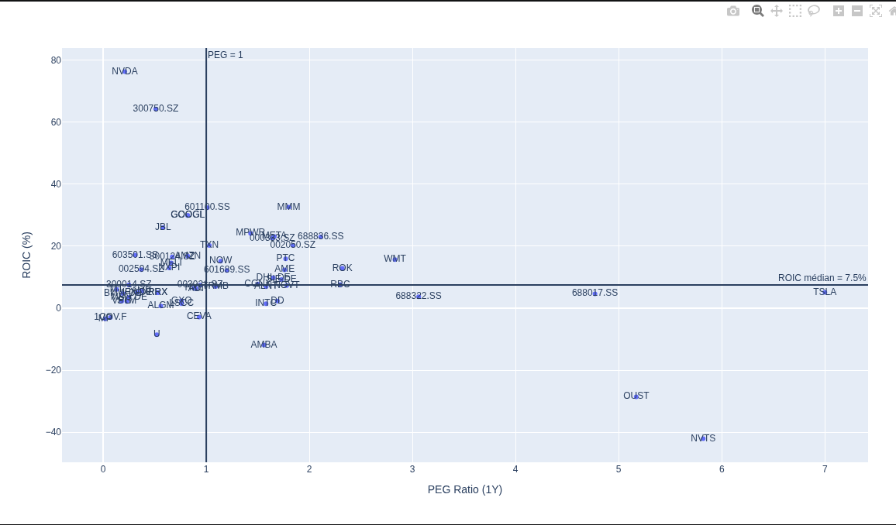

# Robotics Supply Chain — Stock Screening

**Data Analytics portfolio project · Python, Pandas, yfinance, Plotly**

[Français](#français) | [English](#english)



---

<a id="français"></a>
## Français

> J'ai construit une liste de 139 sociétés de la chaîne robotique, vérifié chaque ticker avec `yfinance`, puis filtré les 59 société cotées uniques sur deux indicateurs financiers : le **PEG** (prix payé face à la croissance attendue) et le **ROIC** (efficacité avec laquelle une boîte transforme son capital en profit).
>
> C'est un exercice de tri pour portfolio, pas un conseil en investissement.

### Ce que j'ai fait

| Étape | Action | Résultat |
|-------|--------|----------|
| 1. Mapping | Recherche industrie → 13 niveaux de chaîne robotique + société associées | 139 lignes |
| 2. Nettoyage | Suppression des non-cotées, nettoyage des tickers et des colonnes | 139 → **105** |
| 3. Transformation | Extraction des niveaux dans une colonne dédiée + dédoublonnage | 105 → **102** |
| 4. Validation | Test de chaque ticker contre `yfinance` (suffixes pays : `.T`, `.KS`, `.SS`, `.DE`…) | **103** tickers valides |
| 5. KPIs | Récupération des données financières + calcul PEG et ROIC | **71** tickers avec assez de données |
| 6. Graphique | Scatter plot PEG vs ROIC, médianes en séparateurs | **59** sociétés (58 avec ROIC) |


Formules : `PEG = Forward PE / (croissance EPS attendue)` et `ROIC = NOPAT / Capital investi`, avec `NOPAT = EBIT x (1 - taux d'impôt)`. Tout est documenté dans les notebooks `01` à `06`.

### Les deux KPIs, en une phrase

* **PEG** : « je paie combien pour un point de croissance ». Bas = relativement pas cher.
* **ROIC** : « la boîte est-elle efficace ». Haut = bien gérée.

Graphique coupé sur les médianes (**PEG 0.97 / ROIC 7.5%**) : haut-gauche prometteur, haut-droit bon mais cher, bas-gauche pas cher mais fragile, bas-droit à écarter.

### Ce que j'en retiens

* **11 sociétés prometteuses** sur ce filtre : NVIDIA (0.21 / 76.3%), CATL (0.51 / 64.2%), Alphabet (0.82 / 29.9%), Jabil (0.58 / 26.0%), Omnivision, BYD, EVE, Inovance, NXP, MercadoLibre, Amazon.
* **Point le plus contre-intuitif** : un PEG proche de zéro avec un ROIC négatif (MP Materials 0.02 / -3.5%, Unity 0.52 / -8.6%) **n'est pas une affaire**, c'est un signal d'alerte.
* **Le thème ne suffit pas** : être exposé à la robotique ne dit rien. Deux sociétés du même secteur peuvent être à des années-lumière une fois l'efficacité et la valorisation regardées. Les puces, batteries et assemblages ressortent mieux que le hardware robot pur.
* **10 sociétés écartées** car PEG négatif (croissance attendue négative, donc PEG illisible) : QCOM, ABB, SQM, HSAI, BAS, EVK, XPEV, ALB, UUUU, USAR.

### Limites assumées

Un seul instantané temporel, pas d'historique. Un EPS proche de zéro fait bouger le PEG fortement. ROIC simplifié (pas d'ajustement goodwill, leases, cash excédentaire). Devises et exercices fiscaux mélangés. L'exposition robotique est un drapeau oui/non, pas une part de chiffre d'affaires.

### Prochaines étapes

**Approfondir l'analyse stock :**

* Historiser 3 à 5 ans de ROIC, free cash flow et marges pour voir ce qui tient dans le temps.
* Ajouter EV/EBITDA, rendement du FCF et croissance du chiffre d'affaires à côté du PEG.
* Élaguer les 10 sociétés à PEG négatif avec une lecture de trajectoire de croissance plutôt qu'un simple ratio.
* Supprimer les doublons en amont, aligner devises et calendriers, resserrer la formule du ROIC.

**Passer à l'analyse par niveau de la chaîne de valeur (étape suivante du projet) :**

* Constituer un **tableau de bord par couche de la chaîne de valeur** : nombre de sociétés cotées, capitalisation, PEG médian, ROIC médian, croissance — pour comparer les 13 niveaux entre eux au lieu de tout mélanger sur un seul graphique.
* Identifier **où se concentre la valeur** : comparer la performance de l'amont (minerais, raffinage) à celle de l'aval (OEM, intégrateurs, services). Est-ce que le goulot d'étranglement (actuateurs, engrenages, vis) capte vraiment la marge, ou est-elle déjà captée par les semi-conducteurs ?
* Mesurer la **dispersion intra-couche** : un niveau cohérent (toutes les boîtes du même profil) est un signal plus fiable qu'un niveau très hétérogène.
* Pondérer par la **part robotique réelle du chiffre d'affaires** au lieu du drapeau oui/non, puis comparer des sous-segments homogènes (composants vs services, logistique vs intégration).
* Construire une lecture de **fossé concurrentiel par couche** : mapper les scores de rareté déjà documentés dans `docs/` (réducteurs harmoniques 16/16, mains de précision 15/16, vis planétaires 14/16) sur les sociétés cotées correspondantes, et y ajouter les barriers à l'entrée, la concentration du marché et l'exposition aux terres rares / tensions Chine-Taïwan.

### Reproduire le projet

```bash
python -m venv .venv && source .venv/bin/activate
pip install -r requirements.txt
jupyter notebook notebooks/"Stocks Analysis"/06_STOCKS_analysis.ipynb
# input : data/processed/stocks_kpis.csv
# output : docs/images/peg-vs-roic.png
```

### Structure

```text
data/raw/         # stocks.csv (139), supply_chain_levels.csv (13)
data/processed/   # cleaned, transformed_verified (103), stocks_kpis.csv (71)
notebooks/Stocks Analysis/  # 01 exploration -> 06 analyse (PEG vs ROIC)
docs/             # mapping de la chaîne robotique + images générées
```

> **Avertissement** : projet portfolio et d'apprentissage. Données `yfinance` au moment du tirage, les estimations bougent vite. Pas un conseil financier.

---

<a id="english"></a>
## English

> I built a list of 139 companies across the robotics supply chain, validated every ticker against `yfinance`, then screened the 59 unique listed companies on two financial KPIs: **PEG** (price paid per unit of expected growth) and **ROIC** (how efficiently a company turns invested capital into profit).
>
> This is a screening exercise for a portfolio, not investment advice.

### What I built

| Step | Action | Result |
|------|--------|--------|
| 1. Map | Industry research into 13 robotics supply chain levels plus the companies in each | 139 rows |
| 2. Clean | Removed private/non-profit entries, stripped exchange suffixes, tidied columns | 139 → **105** |
| 3. Transform | Extracted level IDs into a dedicated column + de-duplicated | 105 → **102** |
| 4. Validate | Tested each ticker against `yfinance` (country suffixes: `.T`, `.KS`, `.SS`, `.DE`…) | **103** valid tickers |
| 5. KPIs | Pulled financial data and computed PEG + ROIC | **71** tickers with enough data |
| 6. Screen | PEG vs ROIC scatter plot with median reference lines | **59** companies (58 with ROIC) |


Formulas: `PEG = Forward PE / expected EPS growth` and `ROIC = NOPAT / Invested Capital`, with `NOPAT = EBIT x (1 - tax rate)`. Everything is documented in notebooks `01` to `06`.

### The two KPIs, in one line each

* **PEG**: "what am I paying per point of growth". Low = relatively cheap.
* **ROIC**: "is the business efficient". High = well run.

Chart is split on the medians (**PEG 0.97 / ROIC 7.5%**): top-left promising, top-right good but pricey, bottom-left cheap but soft, bottom-right skip.

### What I take away

* **11 companies look promising** on this screen: NVIDIA (0.21 / 76.3%), CATL (0.51 / 64.2%), Alphabet (0.82 / 29.9%), Jabil (0.58 / 26.0%), Omnivision, BYD, EVE, Inovance, NXP, MercadoLibre, Amazon.
* **Most counter-intuitive finding**: a PEG near zero with a negative ROIC (MP Materials 0.02 / -3.5%, Unity 0.52 / -8.6%) is **not a bargain, it is a warning sign**.
* **The theme is not the story**: robotics exposure says very little on its own. Chips, batteries and electronics manufacturing screen better than pure robot hardware.
* **10 companies excluded** on negative PEG (negative expected growth makes the ratio unreadable): QCOM, ABB, SQM, HSAI, BAS, EVK, XPEV, ALB, UUUU, USAR.

### Known limitations

One snapshot in time, no history. EPS near zero swings PEG hard. Simplified ROIC (no goodwill, lease or excess-cash adjustments). Mixed currencies and fiscal calendars. Robotics exposure is a yes/no flag, not a revenue share.

### Next steps

**Deepening the stock analysis:**

* Add 3 to 5 years of ROIC, free cash flow and margins to see what holds up over time.
* Bring in EV/EBITDA, FCF yield and revenue growth alongside PEG.
* Handle the negative-PEG names with an actual earnings trajectory instead of dropping them.
* Deduplicate upstream, align FX and fiscal calendars, tighten the ROIC formula.

**Moving to value-chain level analysis (the natural next step on this project):**

* Build a **per-layer dashboard**: number of listed companies, market cap, median PEG, median ROIC, growth — so the 13 levels can be compared with each other instead of being blended on a single chart.
* Find **where value concentrates**: compare upstream (mining, refining) performance against downstream (OEMs, integrators, services). Does the actuator/gear bottleneck really capture the margin, or is it already captured by semiconductors?
* Measure **dispersion within each layer**: a homogeneous layer (all companies with the same profile) is a more reliable signal than a very mixed one.
* Weight by **actual robotics revenue share** rather than a yes/no flag, then compare like with like (components vs services, logistics vs integration).
* Add a **per-layer moat view**: map the scarcity scores already documented in `docs/` (harmonic reduction gears 16/16, dexterous hands 15/16, planetary roller screws 14/16) onto the matching listed companies, and add entry barriers, market concentration and rare earth / China-Taiwan exposure.

### How to rerun

```bash
python -m venv .venv && source .venv/bin/activate
pip install -r requirements.txt
jupyter notebook notebooks/"Stocks Analysis"/06_STOCKS_analysis.ipynb
# input: data/processed/stocks_kpis.csv
# output: docs/images/peg-vs-roic.png
```

### Layout

```text
data/raw/         # stocks.csv (139), supply_chain_levels.csv (13)
data/processed/   # cleaned, transformed_verified (103), stocks_kpis.csv (71)
notebooks/Stocks Analysis/  # 01 exploration -> 06 analysis (PEG vs ROIC)
docs/             # robotics supply chain mapping + generated images
```

> **Disclaimer**: portfolio and learning project. Data came from `yfinance` when I pulled it and forward estimates change fast. Not financial advice.